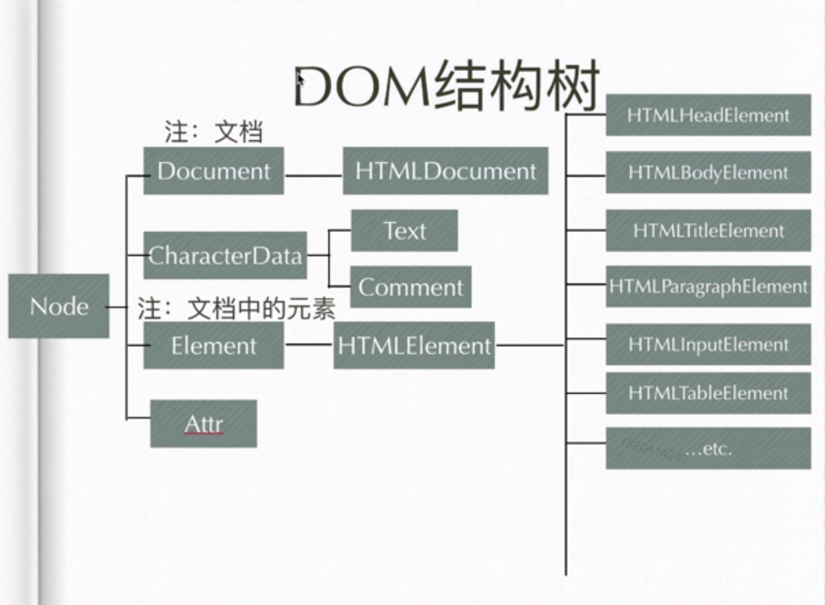

# javascript 学习

## DOM (DOCUMENT OBJECT MODEL)

> DOM 定义了表示和修改文档的方法，DOM对象即为宿主对象，由浏览器厂商定义，用来操作html 、XML (功能一类集合，也有人称DOM是对HTML 以及XML的标准编程接口)

## DOM的基本操作

### 查看元素节点

> 1. `document`代表整个节点
>
> 2. `document.getElementById()` 元素id 在IE8以下的浏览器不区分大小写，而且也匹配name属性的元素
> 3. `document.getElementsTagName()` 标签名
> 4. `document.getElementSByName()` 需注意，只有部分标签的name可以生效（表单、表单元素、img 、 iframe）
> 5. `document.getElementsByClassName()` 类名，IE8及 IE8以下浏览器没有，可以多个calss一起获取
> 6. `querSelector()` css选择器，在IE7 及IE7以下浏览器没有
> 7. `querySelectorAll()` css选择器，在IE7 及IE7以下浏览器没有

```HTML
<div id ="box"></div>
<div class="box"></div>
<div class="box"></div>
<div class="box"></div>s
<input type="text" name="input" />
<ul class="wrap">
<li></li>
<li></li>
<li></li>
</ul>
```

```javascript
var divID = document.getElementById("box"),
    divClass = document.getElementsByClassName("box"),
    inptuName = document.getElementsByName("input"),
    pTag = document.getElementsByTagName("p"),
    divSele = document.querySelector(".wrap li"),
    divSeleAll = document.querySelectorAll(".wrap li");
console.log(divID);//返回结果为：<div id ="box"></div>
console.log(divClass);//返回结果为：[div.box,div.box,div.box]
console.log(inptuName);//返回结果为：[input]
console.log(pTag);//返回结果为：[p]
console.log(divSele);//返回的结果为 : <li></li>
console.log(divSeleAll);//返回的结果为 : [li,li,li]
```

### 遍历节点树

> 1. `parentNode` ==> 父节点 （最顶端的父节点为#document）
>
> 2. `ChildNodes` ==> 子节点们
> 3. `firstChild` ==> 第一个子节点
> 4. `lastChild` ==> 最后一个子节点
> 5. `nextSibling` ==> 后一个兄弟节点
> 6. previousSilbling ==> 前一个兄弟节点

```HTML
<div class="app">
    <p class="word"></p>
    <p></p>
    田
    <span></span>
    123
    <p></p>
</div>
```

```javascript
var divApp = document.getElementsByClassName("app")[0],
    pWord = document.getElementsByClassName("word")[0],
    spanTag = document.getElementsByTagName("span")[0],
    ele1 = pWord.parentNode;
    ele2 = divApp.childNodes;
    ele3 = divApp.firstChild;
    ele4 = divApp.lastChild;
    ele5 = spanTag.nextSibling;
    ele6 = spanTag.previousSibling;
console.log(ele1);//结果为：<div class="app"></div>
console.log(ele2);//结果为： [text, p.word, text, p, text, p, text]
console.log(ele3);//结果为 #text
console.log(ele4);//结果为 #text
console.log(ele5);//结果为 ："123"
console.log(ele6);//结果为 ："田"
```

### 遍历元素节点树

> 1. `parsentElement`返回当前元素的父元素节点（IE不兼容）
>
> 2. `Children` 返回当前元素的子节点
> 3. `node.childElementCount` === `node.Children.length`当前元素的子元素节点个数
> 4. `firstElemntChild` 返回的是当前元素下的第一个子元素节点（IE不兼容）
> 5. `lastElementChild` 返回的是最后一个元素节点（IE不兼容）
> 6. `nextElementsibling`返回后一个兄弟元素节点
> 7. `previousElementsibling`返回前一个兄弟元素节点

```HTML
<div class="app">
    <p class="word"></p>
    <p></p>
    田
    <span></span>
    123
    <p></p>
</div>
```

```javascript
var divApp = document.getElementsByClassName("app")[0],
    pWord = document.getElementsByClassName("word")[0],
    spanTag = document.getElementsByTagName("span")[0],
    ele = divApp.parentElement;
    ele1 = divApp.children;
    ele2 = divApp.childElementCount;
    ele3 = divApp.firstElementChild;
    ele4 = divApp.lastElementChild;
    ele5 = spanTag.nextElementSibling;
    ele6 = spanTag.previousElementSibling;
console.log(ele) //返回结果为body
console.log(ele1)//返回的结果为：[p.word, p, span, p]   
console.log(ele2)//返回的结果为 4
console.log(ele3)//返回的结果为 <p class="word"></p>
console.log(ele4)//返回的结果为 ：<p> </p>
console.log(ele5)//返回的结果为 ：<p> </p>
console.log(ele6)//返回的结果为： <p> </p>
```

### 节点的四个属性

> 1. `nodeNanme` 元素的标签名，只读
>
> 2. `nodeValue`节点的文本内容 可读写
> 3. `nodeType` 节点的类型 只读
> 4. `attributes` element节点的属性集合


```HTML
<div class="app">
    <p class="word">33</p>
    <p></p>
    田
    <span></span>
    123
    <p></p>
</div>
```

```javascript
var divApp = document.getElementsByClassName("app")[0],
    pWord = document.getElementsByClassName("word")[0],
    spanTag = document.getElementsByTagName("span")[0],
    ele = divApp.nodeName;
    ele1 = divApp.nodeType;
    ele2 = pWord.attributes;
console.log(ele)//返回的结果为 DIV
console.log(ele1)//返回结果为 1
console.log(ele2)//返回的结果为{0: class, class: class, length: 1}

```

### 节点的类型

> 1. 元素节点 ==> 1
>
> 2. 属性节点 ==> 2
> 3. 文本节点 ==> 3
> 4. 注释节点 ==> 8
> 5. document ==> 9
> 6. DocumentFragment ==> 11

## DOM结构树



## DOM基本操作（深入）

> 1. `getElementsById` 方法定义在Document.prototype上，即Element上不能使用
>
> 2. `getElementByName` 方法定义在HTMLDocument.prototype上,即非html中的document不能使用（XML.document）
> 3. `getElementTagName`方法定义在Document.prototype和Element.prototype上
> 4. `HTMLDocument.prototype`上定义了一些常用的属性，body、head分别指代HTML文档中的<body>标签
> 5. `Document.prototype`上定义了documentElement属性，指代文档的根元素在html文档中，
> 6. `getElementClassName` 、`querySelectorAll` 、`querySelector` 在Document.prototype和Element.prototype中均能使用

## 封装函数，返回元素e的第n层祖先元素节点

```javascript
function retParent(elem,n){
    while(elem && n){
        elem = elem.parentElement;
        n --;
    }
    return elem;
    }
```

## 编辑函数，封装myChildre功能，解决以前部分浏览器的兼容性问题

```javascript
function myChildren(elem){
    var child = elem.childNodes,
        len = child.length,
        arr = []
        for(var i = 0;i < len; i++){
            if(child[i].nodeType == 1){
                arr.push(child[i])
            }
        }
        return arr;
}
```

## 封装hasChildren()方法，不可用children属性

```javascript
function hasChildren(elem) {
    var child = elem.childNodes,
        len = child.length;
    for (var i = 0; i < len; i++) {
        if (child[i].nodeType == 1) {
            return true
        }
    }
    return false;
}
```

## 封装函数，返回元素e的第n个兄弟元素节点，n为正，返回后面的兄弟元素节点，n为负，返回前面的兄弟元素节点

```javascript
function retSilbing(elem, n) {
    while (elem && n) {
        if (n > 0) {
            if (elem.nextElementSibling) {
                elem = elem.nextElementSibling;
            } else {
                for (elem = elem.nextSibling; elem && elem.nodeType != 1; elem = elem.nextSibling);
            }
            n--;
        } else {
            if (elem.previousElementSibling) {
                elem = elem.previousElementSibling;
            } else {
                for (elem = elem.previousSibling; elem && elem.nodeType != 1; elem = elem.previousSibling);
            }
            n++;
        }
    }
    return elem;
}
```

## DOM创建节点

> 1. `document.createElement()` 创建元素节点

```javascript
var div  = document.createElement("div");
    console.log(div)//返回的结果为 ：<div></div>
```

> 2. `document.createTextVode()`创建文本节点

```javascript
var text = document.createTextNode("123");
    console.log(text)//返回结果为："123"
```

> 3. `document.craeteComment()` 创建注释节点

```javascript
var com = document.createComment("注释")
    console.log(com)//返回的结果为 <--注释-->
```

## DOM插入节点

> 1. `parentNode.appendChild()` 插入元素节点（剪切操做）

```javascript
 var i  = document.createElement("i");
     span.appendChild(i);
     console.log(span)//返回的结果为 <span><i></i></span>
```

> 2. `parentNode.insertBefore(a,b)`在元素 b 之前插入 a

```javascript
var i  = document.createElement("i");
    div.insertBefore(i,span);
    console.log(div)//返回结果为 <div><i></i><span></span></div>
```

## DOM替换节点

> 1. `parentNode.replaceChild(new,origin)` 新的元素节点替换旧的元素节点

```javascript
var i  = document.createElement("i");
    div.replaceChild(i,span);
    console.log(ele)//返回的结果为 <div><i><i></div>
```

## Element节点的属性

> 1. innerHTML
>
> 2. innerText(火狐不兼容) / textContent(兼容火狐 老版本IE浏览器不兼容)

## Element节点的方法

> `element.setAttribute()`

```HTML
<div></div>
```

```javascript
var div = document.getElementsByTagName("div")[0];
    div.setAttribute("id","box");
    console.log(div)//返回结果为： <div id="box"></div>
```

> `element.getAttribute()`

```HTML
<div class="box"></div>
```

```javascript
var div = document.getElementsByTagName("div")[0],
    Class = div.getAttribute("class");
    console.log(Class)//返回结果为 ： box
```

## 封装 insertAfter()功内类似insertBefore()

```javascript
Element.prototype.insertAfter = function(targetNode,originNode){
    var beforeNodes = originNode.nextElementSibling;
    console.log(beforeNodes)
    if(beforeNodes == null){
        this.appendChild(targetNode);
    }else{
        this.insertBefore(targetNode,beforeNodes);
    }
}

//兼容模式
Element.prototype.insetAfter = function (targetNode, originNode) {
    if (originNode.nextElementSibling) {
        originNode = originNode.nextElementSibling;
    } else {
        for (originNode = originNode.nextSibling; originNode && originNode.nodeType != 1; originNode = originNode.nextSibling);
    }
    if (originNode == null) {
        this.appendChild(targetNode);
    }else{
        this.insertBefore(targetNode,originNode)
    }
}   
```

## 将元素内的子元素颠倒顺序（倒数第一个位第一个，依次类推，第一个为倒数第一个）

```javascript
Element.prototype.reverseNode = function(){
    var ele = this.children,
    len = ele.length,
    arr = [],
    temp = {0 : "abc"}
    for(var i = 0;i < len;i++){
        arr.push(i),
        arr.sort(function(a,b){
            return b - a;
        })
    }
    for(var i = 0;i < arr.length;i++){
        temp[i] = ele[arr[i]];
        this.appendChild(temp[i])
    }
}
```

## 封装方法 udNode（a,b）子元素a和b调换位置

```javascript
Element.prototype.udNode = function (target, origin) {
    if (target.nextElementSibling == origin) {
        this.insertBefore(origin, target);
    } else if (origin.nextElementSibling == target) {
        this.insertBefore(target, origin);
    }
}
```
