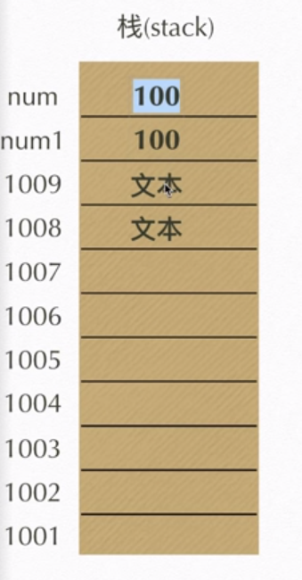
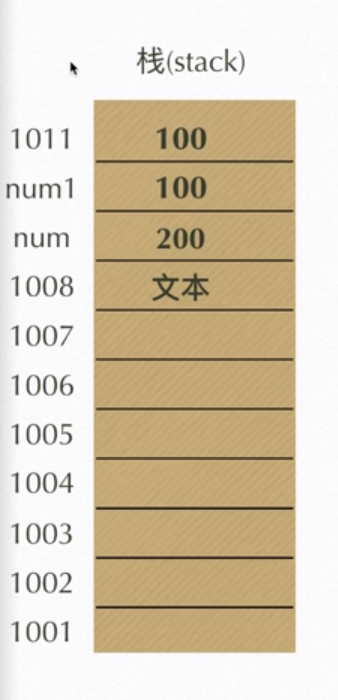
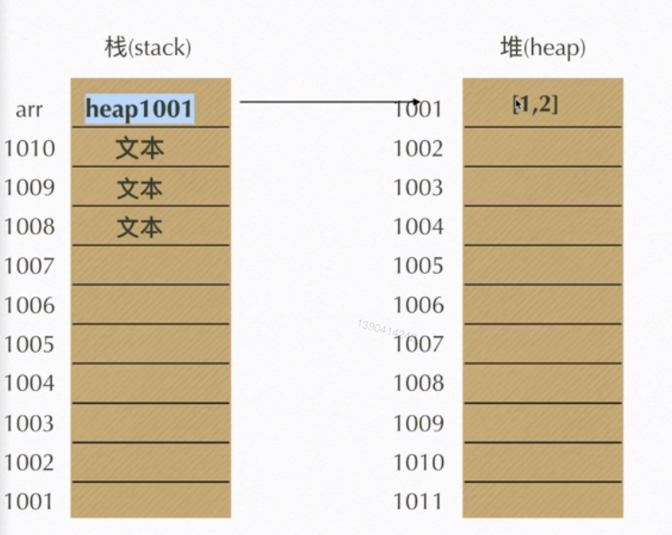
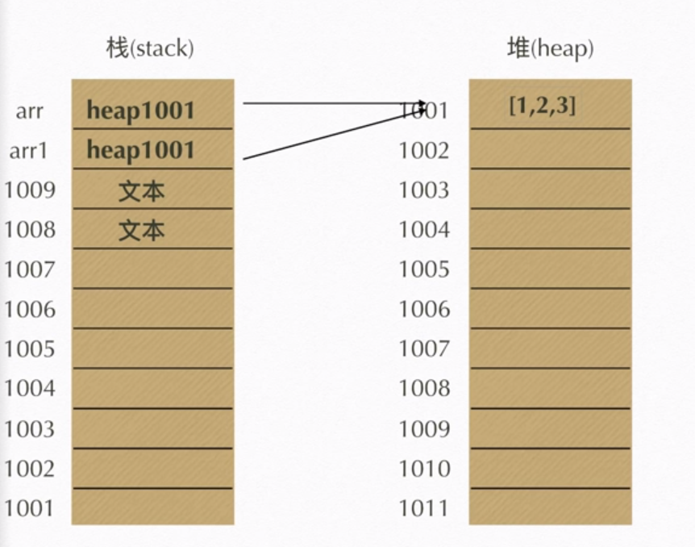
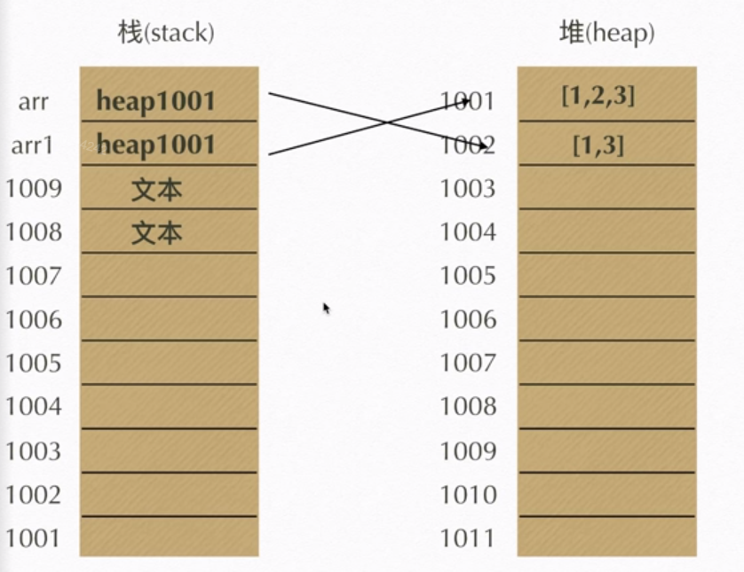

# javascript学习

## 编译型语言与解释与语言

1. 编译性语言:通片翻译，生成文件将其执行。速度快，移植性不好（不跨平台）如：C、C++
2. 解释性语言：翻译一行执行一行，速度慢，可跨平台。如：javascript 、php

## javascript历史

* javascript作为Netscape Navigator 浏览器的一部分首次出现在1996年。它最初的设计目标是改善网用户体验
* 作者：Brendan Eich
* 初期javascript被命名为liveScript,后因和sun公司合作,因市场宣传需要改名为javascript。后来sun公司被Oracle公司收购，javascript归Oracle所有

## javascript执行队列

> 轮转时间片: 将任务分成时间快，然后将时间块分给a、b,a执行完后，b执行，依此类推，最后执行完任务。

## javascript三大部分

1. ECMAScript
2. DOM
3. BOM

## 主流浏览器与其内核

<table border="1" bgcolor="#f1f1f1" style="color:#333;text-align:center">
    <th >浏览器</th>
    <th>内核</th>
    <tr bgcolor="#ccc">
        <td>IE浏览器</td>
         <td>trident</td>
    </tr>
    <tr bgcolor="#ccc">
        <td>chrome浏览器</td>
         <td>webkit/blink</td>
    </tr>
    <tr bgcolor="#ccc">
        <td>firefox浏览器</td>
         <td>Gecko</td>
    </tr>
    <tr bgcolor="#ccc">
        <td>opera浏览器</td>
         <td>Presto</td>
    </tr>
    <tr bgcolor="#ccc">
        <td>safari浏览器</td>
         <td>webkit</td>
    </tr>
</table>

# 使用javascript

## 如何引入js

1. 页面内嵌js

> `<script></script>`

2. 外部引用js(推入使用)
 
> `<script src="index.js"></script>`

## javascript基本语法

### 变量声明

1. 声明变量、赋值、分解。

> `var a = 100`

2. 单一 var
   
> `var a,b,c,d;`

### 命名规则

1. 变量名必须以英文（字母）, （_下划线） , （$） 开头
2. 变量名可包括（字母）, （_下划线） , （$）, (数字)
3. 变量名不可以使用保留字或关键字

### 值类型-数据类型

1. 不可改变的原始值（栈数据 stack）

> `Number , String , Boolean , undefind , null`

```javascript
var num = 100;
var num1 = num;
num = 200
console.log(num1)
console.log(num)
//结果为 num1 = 10 num = 20
```


1. 引用值（推数据 heap）

>`array , object , function`

```javascript
var arr = [1,2];
var arr1 = arr;
arr1.push(3)//push是在数里面加入内容
arr.push(3)
//结果为 arr = [1,2,3] arr1 = [1,2,3]
```



```javascript
var arr = [1,2];
var arr1 = arr;
arr = [1,3]
console.log(arr)
console.log(arr1)

//结果为 arr = [1,3] arr1 = [1,2]
```



**注意**

>栈内存是将值存入相应的房间，不会相互改变，而推内存是是将数据值存入推内存，将推内存地址存入栈数据，会相互改变

### javascript语句基本规则

* 语句后面要用分号结束
* js语法错误会引发后续代码终止，但不会影响其它代码块
* 书写格式要规范 , '+' '+' '-' 两边都应该有空格
  
## javascript运算符

### js运算操作符

#### "+"（加）

1. 数学运算符、 字符串连接
2. 任何数据类型加字符串都等于字符串

```javascript
var a = 1 + 1;
console.log(a)
//结果为 a =  2;
var b = "你好" + 123;
console.log(b)
//结果为 b = "你好123"
```

#### "-"（减）

```javascript
var a = 1 - 1;
console.log(a)
//结果为 a =  0;
```

#### "*"（乘）

```javascript
var a = 1 * 3;
console.log(a)
//结果为 a =  3;
```

#### "/"(除)

```javascript
var a = 0 * 0;
console.log(a)
//结果为 a =  NAN;在数学中除数不能为0 而js将不能表示的数值用NAN表示
var b = 1 / 0;
console.log(a)
//结果为 a =  Infinity(正无穷);
```

#### %(取余数)

```javascript
var a = 5 % 2;
console.log(a)
//结果为 a = 1; 
```

#### =（赋值）

```javascript
var a = "你好";
var b = 123;
console.log(a)
console.log(b)
//结果为 a = 你好 b = 123
```

#### ()

```javascript
var a = 1 + ( 3 - 2 );
console.log(a)
//结果为 a = 2
```

> **注意**
> "=" 优先级最弱，"()"优先级最强

#### ++

> 自身加一再赋值给自身

```javascript
var a = 10;
    a ++;
    console.log(a)
//结果为  a = 11
```

#### --

> 自身减一再赋值给自身

```javascript
var a = 10;
    a --;
    console.log(a)
//结果为  a = 9
```

#### --

> 自身减一再赋值给自身

```javascript
var a = 10;
    a --;
    console.log(a)
//结果为  a = 9
```

> **注意**
>
> 1. a++ : 表示先执行语句再加一
> 2. ++a : 表示先加一再执行语句
> 3. --和++同理
>
> 赋值顺序自右向左，计算顺序自左向右

```javascript
var a = 10;
var b = ++a - 1 + a++;
console.log(b + "" + a)
//结果为 21 12
```

#### +=

> 自身加规定的值再赋值给自身

```javascript
var a = 10;
    a += 10;
console.log(a)
//结果为 20
```

#### -=

> 自身减规定的值再赋值给自身

```javascript
var a = 20;
    a -= 10;
console.log(a)
//结果为 10
```

#### *=

> 自身乘规定的值再赋值给自身

```javascript
var a = 20;
    a *= 10;
console.log(a)
//结果为 400
```

#### /=

> 自身乘规定的值再赋值给自身

```javascript
var a = 20;
    a /= 10;
console.log(a)
//结果为 2
```

#### %=

> 自身模(取余）规定的值再赋值给自身

```javascript
var a = 10;
    a %= 3;
console.log(a)
//结果为 1
```

#### 练习

1. 写出打印结果

```javascript
var a = (10 * 3 - 4 / 2 + 1) % 2,
    b = 3;
    b %= a + 3;
    document.write(a++)
    dcument.write("<br>")
    document.write(--b)
//结果为：1
//       2
```

2. var a = 123;var b = 234,请交换a和b的值

```javascript
//第一种
var a = 123,
    b = 234,
    c = a;
    a = b;
    b = c;
//第二种
var a = 123,
    b = 234;
    a = a + b;
    b = a - b;
    a = a - b;
```
