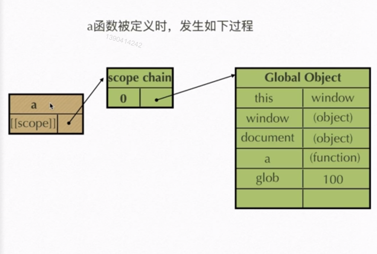
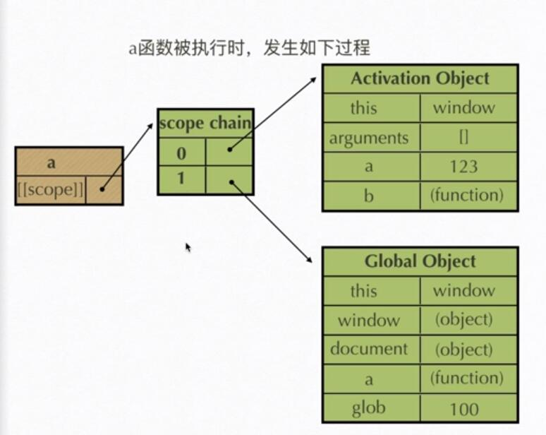
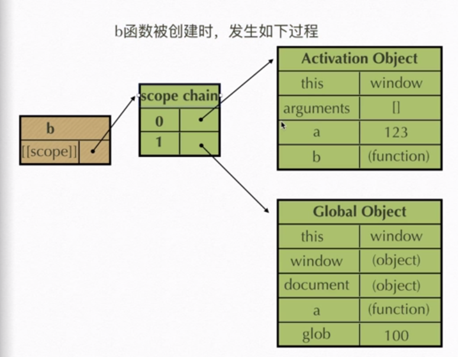
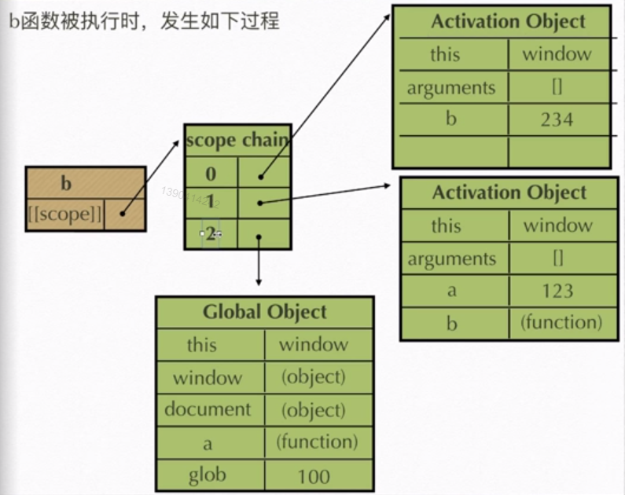

# javascript 学习

## 作用域

### 执行期上下文

> 当函数执行时，会创建一个执行期上下文的内部对象，一个执行期上下文定义了一个函数执行时的坏境，函数每次执行时所对应的执行期上下文时独一无二的，所以多次调用函数会导致创建多个执行期上下文，当函数执行完毕，它所产生的执行期上下文被摧毁
> 

### `[[scope]]`

>每一个javascipt函数都是一个对象，对象中有些的属性我们可以访问，但有些不可以，这些属性仅供javascript引擎存取，`[[scope]]`就是其中一个。
`[[scope]]`指的就是我们所说的作用域，其中存储了运行期上下文的集合

### 作用域链

> `[[scope]]`中所存储的执行期上下文对象的集合，这个集合呈链式连接，我们把这种链式连接叫做作用域链

### 查找变量

> 查找变量是从作用域的顶端依次向下查找

### 作用域具体创建步骤

```javascript
function a(){
    function b(){
        var b = 234;
    }
    var a = 123;
    b();
}
var glob = 100;
a()
```

1. a函数定义时，发生步骤

> a.defind: a.[[scope]] ==>0:GO
>
> a函数定义时，首先创建执行期上下文内部对象，里面第0位放 GO



2. a函数执行时，发生步骤

> a.doing: a.[[scope]] ==>0:GO ,1:AO
>
> a函数执行时，执行期上下文内部对象里面第0位放 AO,第1位存放GO



3. b函数定义是，发生如下过程

> b.defind: b.[scope] ==> 0:GO,1:AO
> 因为a函数的执行，才有了b函数的创建，所以b函数保留了a函数执行期上下文的内部对象



3. b函数执行是，发生如下过程

> b.doing: b.[scope] ==> 0:(b创建的)AO,1:(a创建的)AO,3:GO
> b函数执行时，自身创建AO对象，放在执行期上下文内部对象的顶部，同时也保留a创建的AO对象
>



#### 注意

>当函数执行完后，它会摧毁创建的执行期上下文内部对象，也就是去
掉连接的线，等待下次执行，下次执行时，会产生新的执行期上下文内
部对象

## 立即执行函数

>立即执行函数就是将就函数表达式加上执行符号后立即执行，这类函数没有声明，一i执行完后立即释放，适合做初始化工作

### 常见的立即执行函数

>* `(function (){}())` W3C推荐使用
>* `(function (){})()`

### *注意

> 1. 只有函数表达式才能被立即执行 （`var demo = function()(
> {},var test = function abc(){}, + function test(){}`）
>
>2. 当函数表达式被执行符号立即执行，它就会忽略函数名
>3. 只有表达式才能被执行符号（()）执行,`(function(){})`函数
外面被括号包住，所以就是一个表达式，所以能被()执行
>
>4. 当操作符（）里面传入参数时（1，2，3），就不会被当作执行符号

## 闭包

> 当内部函数被保存到外部时，会形成闭包。闭包会导致原有的作用域链不释放，造成内存泄漏

### 闭包的作用

#### 实现共有变量

例如：函数累加器

```javascript
function add(){
    var count = 0;
    function demo(){
        count ++;
    }
    return demo;
}
add();

```

#### 可以做缓存(存储结构)

```javascript
function eater(){
    var food = "";
    var obj = {
        eat : function(){
            console.log("我吃了"+food);
            food = "";
        },
        push : function(myfood){
            food = myfood;
        }
    }
    return obj;
}
var eater1 = eater();
eater1.push("苹果");
eater1.eat();

```

#### 可以实现封装，属性私有化

```javascript
```

#### 模块发开发，防止污染变量

### 闭包的防范

> 闭包会导致多个执行函数共用一个公有变量，如果不是特殊需要，尽量防止这种情况发生

## 练习

1. 写一个方法，求一个字符串的字节长度。（提示:字符串有一个方法charCodeAt();一个中文占两个字节，一个英文占一个字节）

```javascript
function retByteslen(target){
   var count = 0;
   for(var i = 0; i <= target.length; i++){
       if(target.charCodeAt(i) <= 255){
           count ++;
       }else if(target.charCodeAt(i) > 255){
           count += 2;
       }
   }
   console.log(count)
}
```

2. 写出下列程序执行结果

```javascript
/*
,号运算符，，返回最后表达式的值
（1 + 1， 1 - 1）返回 1 -1的值
*/
var f = (
   function f(){
       return "1";
   },
   function g(){
       return 2;
   }
)();
typeof f;//number
```

3. 写出下列程序执行的结果

```javascript
/*
(function f(){})位表达式，所以没有f
*/
var x = 1;
if(function f(){}){
   x += typeof f;
}
x;//1undefined
```
