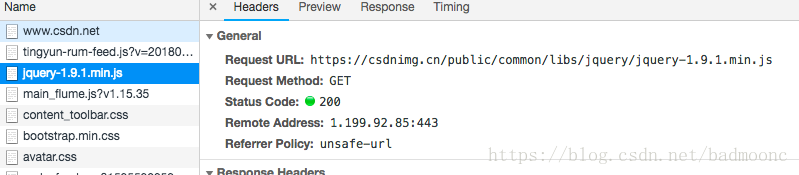

# WEB跨域
## 一、web跨域问题的由来
     同源策略是浏览器上为安全性考虑实施的非常重要的安全策略。为了防止某些文档或脚本加载别的域下的未知内容造成泄露隐私，破坏系统等安全行为。
1. 链接跳转导致的问题
    * http://a.com，放一个链接到icbc.com，然后window.open来打开，window.open有个返回句柄，没有同源，a.com可以拥有对这个页面的完全控制权，拦截表单，捕获数据，将账户密码上传到a.com等。
1. ajax请求，要什么有什么
    * 你登录jd.com产生了登陆cookie;然后打开a.com, a.com通过ajax 请求http://jd.com 的用户信息接口,这时候因为你登陆jd.com,所以a.com发起访问jd.com自动带上了jd的合法cookie，绕过jd的登陆验证,然后获取到你京东的订单list ,昵称, 所有私密信息返还给a.com.【是不是有点像CSRF（跨站请求伪造）?】
    > 所以,为什么需要同源策略，显而易见，必须得限制跨域
 * > （安全性和方便性是成反比的，同源策略提升了Web前端的安全性，但牺牲了Web拓展上的灵活性。所以，现代浏览器在安全性和可用性之间选择了一个平衡点。在遵循同源策略的基础上，选择性地为同源策略“开放了后门”。例如img script style等标签，都允许垮域引用资源，严格说这都是不符合同源要求的。）
## 二、怎样算做跨域 **（同源策略的定义）**
    1995年， Netscape 公司在浏览器中引入同源策略/SOP（Same origin policy）同domain（或ip）,同端口，同协议视为同一个域，一个域内的脚本仅仅具有本域内的权限，可以理解为本域脚本只能读写本域内的资源，而无法访问其它域的资源。这种安全限制称为同源策略。
## 三、常见跨域解决方法
1. JSONP
    * 在js中，我们直接用XMLHttpRequest请求不同域上的数据时，是不可以的。但是，在页面上引入不同域上的js脚本文件却是可以的，jsonp正是利用这个特性来实现的。啥意思？正如前边提到的，ajax访问接口时受同源限制的，但是\<script src="XXX">是不受限制的，所以通过此方法避开同源限制。【通过script的src来加载，这也解释了为什么jsonp只支持get传输】为啥还要有callback参数？因为需要一个代理函数做中间人来处理数据，这个参数成了约定的函数名了。
    * 这样jsonp的原理就很清楚了，通过script标签引入一个js文件，这个js文件载入成功后会执行我们在url参数中指定的函数，并且会把我们需要的json数据作为参数传入。所以jsonp是需要服务器端的页面进行相应的配合的。
    * 如果你的页面使用jquery，那么通过它封装的方法就能很方便的来进行jsonp操作了.原理是一样的，只不过我们不需要手动的插入script标签以及定义回掉函数。jquery会自动生成一个全局函数来替换callback=?中的问号，之后获取到数据后又会自动销毁，实际上就是起一个临时代理函数的作用。$.getJSON方法会自动判断是否跨域，不跨域的话，就调用普通的ajax方法；跨域的话，则会以异步加载js文件的形式来调用jsonp的回调函数。

        * 现在知道了同源策略，那我们就来看下jsonp是如何突破同源策略的限制实现跨域的首先，不知道大家有没有注意，不管是我们的script标签的src还是img标签的src，或者说link标签的href他们没有被通源策略所限制，比如我们有可能使用一个网络上的图片，就可以请求得到
            ```js
            
            ```
        src或href链接的静态资源，本质上来说也是一个get请求，拿csdn上的静态资源举例：
        
        可以看到，确实是个get请求无疑。同理img标签的src和link标签的href也会发送一个get请求去请求静态资源。那么我们通过这点，是不是发现了点什么，这些标签的src和link属性，并没有受同源策略的限制。说到这里jsonp的实现原理就浮出水面了。jsonp就是使用通源策略这一“漏洞”，实现的跨域请求（这也是jsonp跨域只能用get请求的原因所在）。想象一下，既然是个get请求，那么服务端一定可以接收到，并做出反馈。ok，知道这两点之后，我们开始具体使用jsonp进行跨域请求。
        * JSONP跨域实现：
            1. 根据上边所说的，我们要用过利用img、srcipt，link标签的src或href属性（到底使用那个标签无所谓）来实现，那么我们如何做呢，我们来看一段简单的代码，为了方便，我这里使用jQuery：
                ```js   
                $('#btn').click(function(){
			        var frame = document.createElement('script');
			        frame.src = 'http://localhost:3000/article-list?name=leo&   age=30&callback=func';
			        $('body').append(frame);
		        });
                ```
            1. 可以看到，让我们点击按钮的时候，创建了一个script标签(即会发送一个get请求到src指向的地址)，src地址是"localhost:3000/article-list",这个src地址，就是我们请求的服务端接口。注意，这里我们有是那个参数，name,age和callback，name和age不说了，这跟我们平时普通的get请求参数无异。主要说下callback这个参数，callback参数就是核心所在。**为什么要定义callback呢？首先我们知道，这个get请求已经被发出去了，那么我们如何接口请求回来的数据呢，callback=func则可以帮我们做这件事。我们继续看下边的代码**
                ```js
                    <script src="https://cdn.bootcss.com/jquery/3.3.1/jquery.min.js"></script>
                    <script>
                        $('#btn').click(function(){
                            var frame = document.createElement('script');
                            frame.src = 'http://localhost:3000/article-list?name=leo&age=30&callback=func';
                            $('body').append(frame);
                        });
                        
                        function func(res){
                            alert(res.message+res.name+'你已经'+res.age+'岁了');
                        }
                    </script>

                ```
            这里可以看到，我们声明了一个func函数，但没有执行，你可以想一下，如果服务端接口到get请求，返回的是**func({message:'hello'})，这样的话在服务端不就可以把数据通过函数执行传参的方式实现数据传递了吗。**
1. CORS
    * CORS（跨域资源共享，Cross-Origin Resource Sharing）是通过客户端+服务端协作声明的方式来确保请求安全的。服务端会在HTTP请求头中增加一系列HTTP请求参数(例如Access-Control-Allow-Origin等)，来限制哪些域的请求和哪些请求类型可以接受。可以在代码里写，也可以写在服务器配置文件里。
    * 先解释下有什么配置，不用全写，按需选取配置即可
        * Access-Control-Allow-Origin:指定授权访问的域
        * Access-Control-Allow-Methods：授权请求的方法（GET,POST,PUT,DELETE，OPTIONS等)
        * Access-Control-Allow-Credentials 首部字段用于预检请求的响应，表明服务器是否允许，credentials标志设置为true的请求。
        * Access-Control-Max-Age：<delta-seconds> 首部字段指明了预检请求的响应的有效时间。delta-seconds 表示该响应在多少秒内有效。
        * Access-Control-Allow-Headers 首部字段用于预检请求的响应。其指明了实际请求中允许携带的首部字段。
    * 实现ajax跨域访问配置可以在代码里，也可以写在服务器配置文件(apache,nginx)里。
        1.  ```js
            1）php代码
            header('Access-Control-Allow-Origin:*');  // 指定允许其他域名访问  
            header('Access-Control-Allow-Methods:POST');  // 响应类型  
            header('Access-Control-Allow-Credentials:true');  //允许客户端传输cookie
            
            2) Nginx
            add_header 'Access-Control-Allow-Origin' '*';
            add_header 'Access-Control-Allow-Methods' 'GET, POST, OPTIONS';
            add_header 'Access-Control-Allow-Credentials' "true";
            
            3) Apache
            Header set Access-Control-Allow-Origin www.a.com
            (打开Credentials与Methods方式暂时报错，待尝试)
            ```
        1.  ```js
            /**
                * yii2 行为方法，自动执行打开跨域@inheritdoc
                */
                public function behaviors()
                {
            
                    return [
                        
                        'corsFilter' => [
                            'class' => \yii\filters\Cors::className(),
                            'cors' => [
                                'Origin' => ['http://a.com','http://b.com'],//多域名设置
                                'Access-Control-Allow-Credentials' => true,
                            ]
                        ],
                    ];

            ```
        1. ```js
            <!-- 前台跨域代码格式 -->
            $.ajax({
                type: 'POST',
                url: 'http://www.b.com' ,
                data: {id:1} ,
                dataType: 'json',
                xhrFields: {withCredentials: 'true'},
                success:function(){alert(121);}
            });
            ```
        
## 四、总结