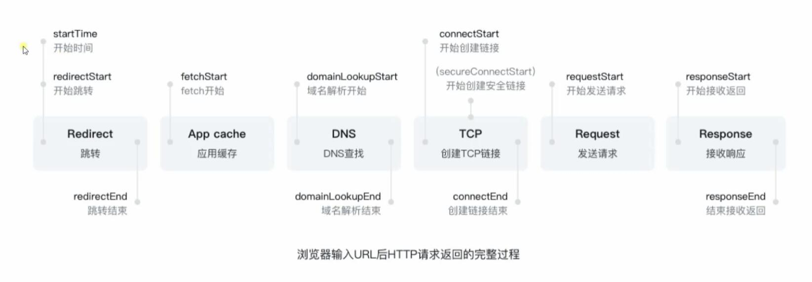
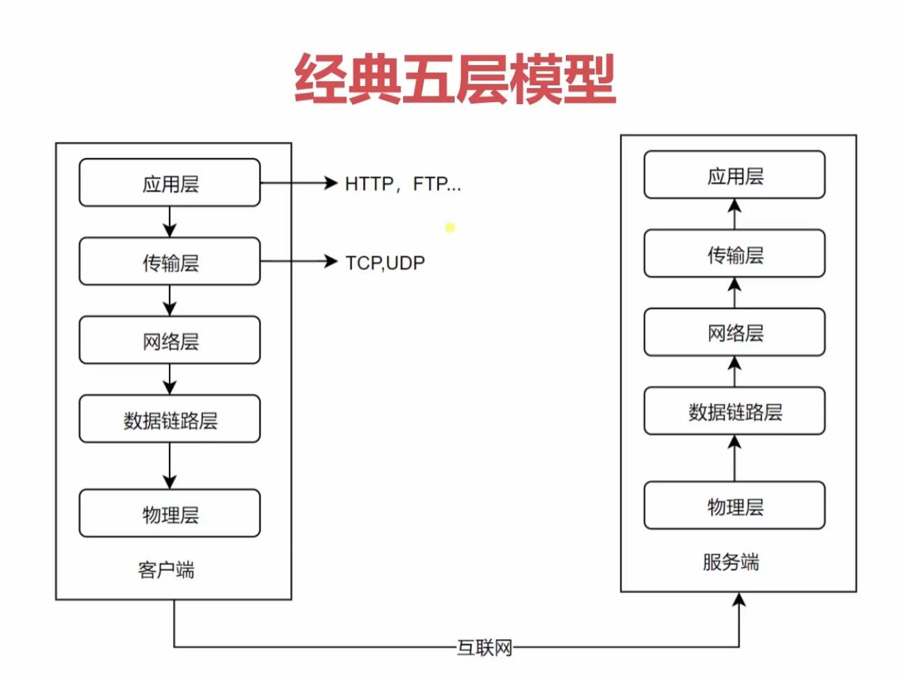
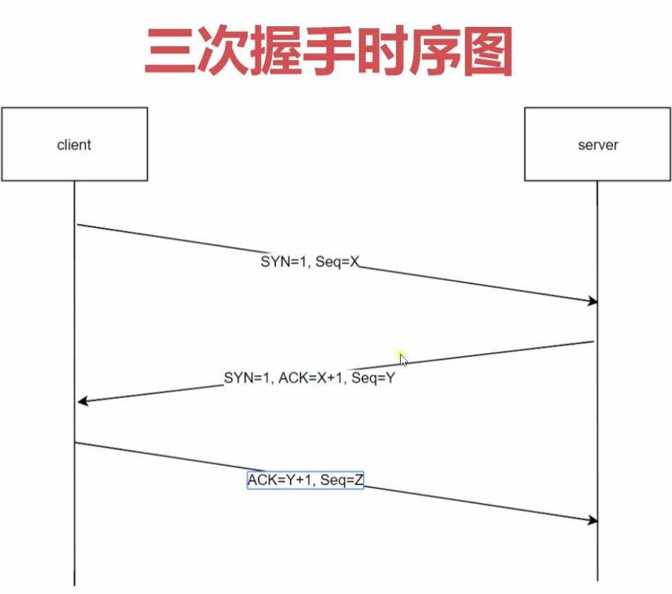
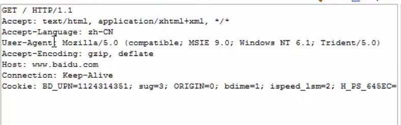
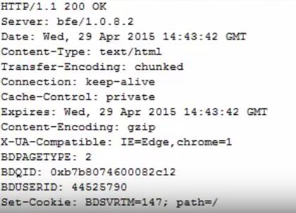
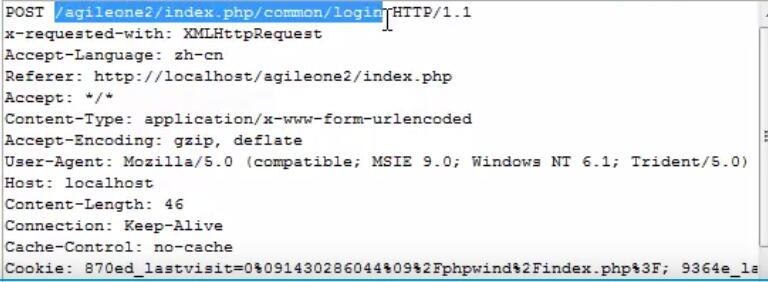
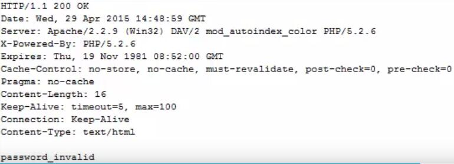

### 

#### Cache-Control
* `public、private设置`

#### 缓存验证
* `last-modified配合if-modified-since`
* `etag配合if-none-match`

#### 更多有意义的头
* `Content-Type、Content-Encoding等用来约束数据类型`
* `Cookie保持会话信息`
* `CORS实现跨域并保持安全性限制`

#### 浏览器输入URL后HTTP请求返回的完整过程

#### 网络协议分层

* 传输层
    * 向用户提供可靠的端到端（End-to-End）服务
        * TCP/IP协议
        * UDP协议
    * 传输层想高层屏蔽了下层数据通信的细节
* 应用层
    * 为应用软件提供了很多服务
    * 构建与TCP协议之上
    * 屏蔽网络传输相关细节
* 后三层
    * 物理层：主要作用是定义物理设备如何传输数据。（作用是负责传输0和1的电信号）
    * 数据链路层： 在通信的实体间建立数据链路连接。
    * 网络层：为数据在结点之间传输创建逻辑链路。

#### http协议发展的历史
1. HTTP/0.9
    * 只有一个命令GET
    * 没有HEADER等描述数据的信息
    * 服务器发送完毕，就关闭了TCP连接（在同一个TCP连接中可以发送多个http请求）。
1. HTTP/1.0
    * 增加很多的命令
    * 增加status code*(描述服务端处理某一个请求后他的状态)*和header
    * 多字符集支持、多部分发送、权限、缓存等。
1. HTTP/1.1（数据大多以字符串传输）
    * 持久连接（在之前的版本中客户端请求后，在服务端返回完数据后，TCP连接就会关闭）
    * pipeline（在一个TCP连接中可以发送多个请求，然而在服务端处理这些请求时都是一个一个处理）
    * 增加host和其他的一些命令。
        * 新增的host用来分辨请求的是哪里，这样一个物理服务器就可以部署多个不同的web服务，然后请求时通过host来判断具体的请求位置。
1. HTTP2*尚未普及*
    * 所有数据的以二进制传输
    * 同一个连接里面发送多个请求不再需要按照顺序来
    * 头信息压缩以及推送等提高效率的功能。
1. HTTPS （多数与HTTP1.0相同）

#### HTTP的三次握手

#### web核心—HTTP协议
##### HTTP协议街简介
* HTTP协议  （HyperText Transfer Protocol）超文本传输协议
* HTML (HyperText Markup Language) 超文本标记语言
* 协议规则： 注重内容本身
*  特点
    1. 传输明文内容，安全性较差
    1. 无状态协议
    1. 应用层协议，标准化协议1.1版本
* HTTP协议主要包含请求和响应，而在请求和响应中都有请求头以及请求正文

#####HTTP请求
* 最常用的请求
    > 1. GET请求获取有Request-URI(URL)所标识的资源
    请求响应
    
    > 1. POST 在Request-URI(URL)所标识的资源后附加新的数据 请求
    响应
    
* 最不常用的请求
    > 1. HEAD请求获取由Resquest-URI(URL)所标识的资源的响应消息头。
    > 1. OPTIONS请求查询服务器的性能，或查询与资源相关的选项和需求。
    > 1. PUT请求服务器存储一个资源，并用Resquest-URI(URL)作为其标识。
    > 1. DELETE 请求服务器删除有Resquest-RUI(URL)所标识的资源。
    > 1. TRACE 请求服务器回送收到的请求信息，主要用于测试和诊断。

##### HTTP状态码
1. 1xx **消息**
    * 这一类型的状态码，代表请求已被接受，需要继续处理。这类响应是临时响应，只包含状态行和某些可选的响应头信息，并以空行结束。由于 HTTP/1.0 协议中没有定义任何 1xx 状态码，所以除非在某些试验条件下，服务器禁止向此类客户端发送 1xx 响应。
1. 2xx  **成功**
    * 这一类型的状态码，代表请求已成功被服务器接收、理解、并接受。
        1. **200**
        请求已成功，请求所希望的响应头或数据体将随此响应返回。
        1. **201**
        有一个新的资源已经依据请求的需要而建立，且其 URI 已经随Location 头信息返回。假如需要的资源无法及时建立的话，应当返回 '202 Accepted'。
        1. **202**服务器已接受请求，但尚未处理。正如它可能被拒绝一样，最终该请求可能会也可能不会被执行。在异步操作的场合下，没有比发送这个状态码更方便的做法了。返回202状态码的响应的目的是允许服务器接受其他过程的请求（例如某个每天只执行一次的基于批处理的操作），而不必让客户端一直保持与服务器的连接直到批处理操作全部完成。在接受请求处理并返回202状态码的响应应当在返回的实体中包含一些指示处理当前状态的信息，以及指向处理状态监视器或状态预测的指针，以便用户能够估计操作是否已经完成
        1. **203**服务器已成功处理了请求，但返回的实体头部元信息不是在原始服务器上有效的确定集合，而是来自本地或者第三方的拷贝。当前的信息可能是原始版本的子集或者超集。例如，包含资源的元数据可能导致原始服务器知道元信息的超级。使用此状态码不是必须的，而且只有在响应不使用此状态码便会返回200 OK的情况下才是合适的。
        1. **204**服务器成功处理了请求，但不需要返回任何实体内容，并且希望返回更新了的元信息。响应可能通过实体头部的形式，返回新的或更新后的元信息。如果存在这些头部信息，则应当与所请求的变量相呼应。如果客户端是浏览器的话，那么用户浏览器应保留发送了该请求的页面，而不产生任何文档视图上的变化，即使按照规范新的或更新后的元信息应当被应用到用户浏览器活动视图中的文档。由于204响应被禁止包含任何消息体，因此它始终以消息头后的第一个空行结尾。
        1. **205**服务器成功处理了请求，且没有返回任何内容。但是与204响应不同，返回此状态码的响应要求请求者重置文档视图。该响应主要是被用于接受用户输入后，立即重置表单，以便用户能够轻松地开始另一次输入。与204响应一样，该响应也被禁止包含任何消息体，且以消息头后的第一个空行结束。
        1. **206**
        * 服务器已经成功处理了部分 GET 请求。类似于 FlashGet 或者迅雷这类的 HTTP 下载工具都是使用此类响应实现断点 续传或者将一个大文档分解为多个下载段同时下载。该请求必须包含 Range 头信息来指示客户端希望得到的内容范围，并且可能包含 If-Range 来作为请求条件。响应必须包含如下的头部域：Content-Range 用以指示本次响应中返回的内容的范围；如果是 Content-Type 为 multipart/byteranges 的多段下载，则每一 multipart 段中都应包含 Content-Range 域用以指示本段的内容范围。假如响应中包含 Content-Length，那么它的数值必须匹配它返回的内容范围的真实字节数。DateETag 和/或 Content-Location，假如同样的请求本应该返回200响应。Expires, Cache-Control，和/或 Vary，假如其值可能与之前相同变量的其他响应对应的值不同的话。假如本响应请求使用了 If-Range 强缓存验证，那么本次响应不应该包含其他实体头；假如本响应的请求使用了 If- Range 弱缓存验证，那么本次响应禁止包含其他实体头；这避免了缓存的实体内容和更新了的实体头信息之间的不一致。 否则，本响应就应当包含所有本应该返回200响应中应当返回的所有实体头部域。假如 ETag 或 Last-Modified 头部不能精确匹配的话，则客户端缓存应禁止将206响应返回的内容与之前任何缓存过 的内容组合在一起。任何不支持 Range 以及 Content-Range 头的缓存都禁止缓存206响应返回的内容。
        1. **207**　由WebDAV(RFC 2518)扩展的状态码，代表之后的消息体将是一个XML消息，并且可能依照之前子请求数量的不同 ，包含一系列独立的响应代码。
1. 3xx **重定向**
    * 这类状态码代表需要客户端采取进一步的操作才能完成请求。通常，这些状态码用来重定向，后续的请求地址（重定向目标）在本次响应的 Location 域中指明。当且仅当后续的请求所使用的方法是 GET 或者 HEAD 时，用户浏览器才可以在没有用户介入的情况下自动提交所需要的后续请求。客户端应当自动监测无限循环重定向（例如：A->A，或者A->B->C->A），因为这会导致服务器和客户端大 量不必要的资源消耗。按照 HTTP/1.0 版规范的建议，浏览器不应自动访问超过5次的重定向。
        1. **300**
        被请求的资源有一系列可供选择的回馈信息，每个都有自己特定的地址和浏览器驱动的商议信息。用户或浏览器能够自行选择一个首选的地址进行重定向。除非这是一个 HEAD 请求，否则该响应应当包括一个资源特性及地址的列表的实体，以便用户或浏览器从中选择最合 适的重定向地址。这个实体的格式由 Content-Type 定义的格式所决定。浏览器可能根据响应的格式以及浏览器自身能力 ，自动作出最合适的选择。当然，RFC 2616规范并没有规定这样的自动选择该如何进行。如果服务器本身已经有了首选的回馈选择，那么在 Location 中应当指明这个回馈的 URI；浏览器可能会将这个 Location 值作为自动重定向的地址。此外，除非额外指定，否则这个响应也是可缓存的。
        1. **301**
        被请求的资源已永久移动到新位置，并且将来任何对此资源的引用都应该使用本响应返回的若干个 URI 之一。如果可 能，拥有链接编辑功能的客户端应当自动把请求的地址修改为从服务器反馈回来的地址。除非额外指定，否则这个响应也是可缓存的。新的永久性的 URI 应当在响应的 Location 域中返回。除非这是一个 HEAD 请求，否则响应的实体中应当包含指向新的 URI 的超链接及简短说明。如果这不是一个 GET 或者 HEAD 请求，因此浏览器禁止自动进行重定向，除非得到用户的确认，因为请求的条件可能因此发生变化。注意：对于某些使用 HTTP/1.0 协议的浏览器，当它们发送的 POST 请求得到了一个301响应的话，接下来的重定向请求将会变成 GET 方式。
        1. **302**
        302请求的资源现在临时从不同的 URI 响应请求。由于这样的重定向是临时的，客户端应当继续向原有地址发送以后的请 求。只有在Cache-Control或Expires中进行了指定的情况下，这个响应才是可缓存的。新的临时性的 URI 应当在响应的 Location 域中返回。除非这是一个 HEAD 请求，否则响应的实体中应当包含指向新的 URI 的超链接及简短说明。如果这不是一个 GET 或者 HEAD 请求，那么浏览器禁止自动进行重定向，除非得到用户的确认，因为请求的条件可能因此发生变化。
        注意：虽然RFC 1945和RFC 2068规范不允许客户端在重定向时改变请求的方法，但是很多现存的浏览器将302响应 视作为303响应，并且使用 GET 方式访问在 Location 中规定的 URI，而无视原先请求的方法。状态码303和307被添加 了进来，用以明确服务器期待客户端进行何种反应。
        1. **303**
        对应当前请求的响应可以在另一个 URI 上被找到，而且客户端应当采用 GET 的方式访问那个资源。这个方法的存在主 要是为了允许由脚本激活的POST请求输出重定向到一个新的资源。这个新的 URI 不是原始资源的替代引用。同时，303响 应禁止被缓存。当然，第二个请求（重定向）可能被缓存。新的 URI 应当在响应的 Location 域中返回。除非这是一个 HEAD 请求，否则响应的实体中应当包含指向新的 URI 的超链接及简短说明。
        注意：许多 HTTP/1.1 版以前的 浏览器不能正确理解303状态。如果需要考虑与这些浏览器之间的互动，302状态码 应该可以胜任，因为大多数的浏览器处理302响应时的方式恰恰就是上述规范要求客户端处理303响应时应当做的。
        1. **304**
        如果客户端发送了一个带条件的 GET 请求且该请求已被允许，而文档的内容（自上次访问以来或者根据请求的条件）并没有改变，则服务器应当返回这个状态码。304响应禁止包含消息体，因此始终以消息头后的第一个空行结尾。该响应必须包含以下的头信息：Date，除非这个服务器没有时钟。假如没有时钟的服务器也遵守这些规则，那么代理服务器以及客户端可以自行将 Date 字段添加到接收到的响应头中去（正如RFC 2068中规定的一样），缓存机制将会正常工作。ETag 和/或 Content-Location，假如同样的请求本应返回200响应。Expires, Cache-Control，和/或Vary，假如其值可能与之前相同变量的其他响应对应的值不同的话。假如本响应请求使用了强缓存验证，那么本次响应不应该包含其他实体头；否则（例如，某个带条件的 GET 请求使用了弱缓存验证），本次响应禁止包含其他实体头；这避免了缓存了的实体内容和更新了的实体头信息之间的不一致。假如某个304响应指明了当前某个实体没有缓存，那么缓存系统必须忽视这个响应，并且重复发送不包含限制条件的请求。假如接收到一个要求更新某个缓存条目的304响应，那么缓存系统必须更新整个条目以反映所有在响应中被更新的字段的值。
        1. **305**
        被请求的资源必须通过指定的代理才能被访问。Location 域中将给出指定的代理所在的 URI 信息，接收者需要重复发 送一个单独的请求，通过这个代理才能访问相应资源。只有原始服务器才能建立305响应。
        注意：RFC 2068中没有明确305响应是为了重定向一个单独的请求，而且只能被原始服务器建立。忽视这些限制可能导致严重的安全后果。
        1. **306**
        在最新版的规范中，306状态码已经不再被使用
        1. **307**
        请求的资源现在临时从不同的URI 响应请求。由于这样的重定向是临时的，客户端应当继续向原有地址发送以后的请求 。只有在Cache-Control或Expires中进行了指定的情况下，这个响应才是可缓存的。新的临时性的URI 应当在响应的 Location 域中返回。除非这是一个HEAD 请求，否则响应的实体中应当包含指向新的URI 的超链接及简短说明。因为部分浏览器不能识别307响应，因此需要添加上述必要信息以便用户能够理解并向新的 URI 发出访问请求。如果这不是一个GET 或者 HEAD 请求，那么浏览器禁止自动进行重定向，除非得到用户的确认，因为请求的条件可能因此发生变化。

        