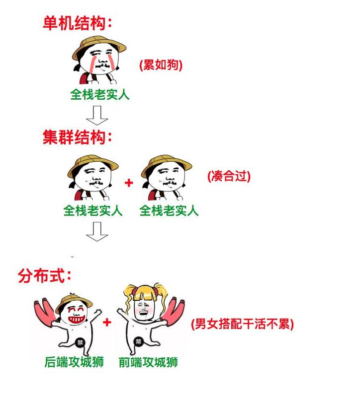

#什么是分布式与集群？
* 图解

1. 分布式
    >分布式是指多个系统协同合作完成一个特殊的任务的系统。
    分布式是解决中心化管理的问题，主要是将分解任务，拆分职能。
1. 集群
    > 集群的使用场景主要是为了分担请求压力，几个服务器同时部署，用来分担请求压力。
* 将一套系统拆分成不同子系统部署在不同服务器上（这叫分布式），然后部署多个相同的子系统在不同的服务器上（这叫集群），部署在不同服务器上的同一个子系统应做负载均衡。 

 

分布式：一个业务拆分为多个子业务，部署在多个服务器上 。 

集群：同一个业务，部署在多个服务器上 。